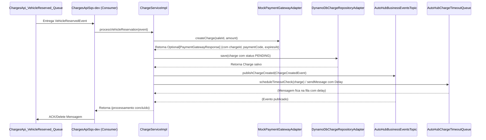

# AutoHub - Charges API

API responsável pelo gerenciamento do ciclo de vida das cobranças (criação, atualização de status via callback,
tratamento de timeouts) e pela interação com o gateway de pagamento (atualmente simulado) na plataforma AutoHub.

## Índice

* [Visão Geral](#visão-geral)
* [Arquitetura](#arquitetura)
* [Tecnologias](#tecnologias)
* [Configuração](#configuração)
    * [Variáveis de Ambiente](#variáveis-de-ambiente)
    * [Ficheiros de Configuração](#ficheiros-de-configuração)
* [Executando Localmente](#executando-localmente)
    * [Com Docker Compose](#com-docker-compose)
    * [Diretamente (Maven/IDE)](#diretamente-mavenide)
* [Testes](#testes)
    * [Testes Locais End-to-End](#testes-locais-end-to-end)
* [API Endpoints (HTTP)](#api-endpoints-http)
* [Eventos Consumidos (SQS)](#eventos-consumidos-sqs)
* [Eventos Publicados (SNS)](#eventos-publicados-sns)
* [Fluxos de Sequência (Diagramas)](#fluxos-de-sequência-diagramas)
* [Modelo de Dados](#modelo-de-dados)
* [Deployment (AWS Lambda)](#deployment-aws-lambda)
* [Contribuição](#contribuição)
* [Licença](#licença)

## Visão Geral

Esta API é um componente central na saga de venda de veículos. Ela é responsável por:

* Receber a notificação de que um veículo foi reservado (`VehicleReservedEvent`).
* Interagir com um gateway de pagamento (atualmente um mock) para criar uma cobrança associada à venda.
* Publicar o evento `ChargeCreated` com os detalhes da cobrança (ex: código PIX, link de pagamento).
* Agendar uma verificação de timeout para a cobrança.
* Receber callbacks (webhooks simulados) do gateway de pagamento para atualizar o status da cobrança (`PAID`, `FAILED`).
* Publicar eventos de resultado do pagamento (`PaymentCompleted`, `PaymentFailed`).
* Processar mensagens de timeout para verificar e marcar cobranças como expiradas, publicando `ChargeExpired`.
* Publicar `ChargeCreationFailed` caso ocorra erro na interação inicial com o gateway ou ao salvar o estado.

## Arquitetura

A API segue a **Arquitetura Hexagonal**, separando o domínio de negócio da infraestrutura.

* **Domínio:** Contém as entidades (`Charge`, `ChargeStatus`), eventos, exceções e as interfaces das portas (entrada:
  `ChargeServicePort`; saída: `ChargeRepositoryPort`, `ChargeEventPublisherPort`, `PaymentGatewayPort`,
  `NotificationServicePort`).
* **Aplicação:** Contém a implementação da lógica de negócio (`ChargeServiceImpl`).
* **Infraestrutura:** Contém os adaptadores:
    * **Entrada:** Controller REST (`ChargeController`) para callbacks e testes; Consumidor SQS (`ChargeEventConsumer`)
      para eventos de negócio e timeouts.
    * **Saída:** Adaptador de persistência para DynamoDB (`DynamoDbChargeRepositoryAdapter`), Adaptador de publicação
      para SNS (`SnsChargeEventPublisherAdapter`), Adaptador mock para o Gateway de Pagamento (
      `MockPaymentGatewayAdapter`), Adaptador mock para Notificações (`MockNotificationServiceAdapter`).
* **Deployment:** A aplicação é empacotada como um "fat JAR" e deployada em duas funções AWS Lambda distintas:
    * **Lambda HTTP:** Acionada pelo API Gateway, usa `StreamLambdaHandler` (`aws-serverless-java-container`).
      Responsável pelos endpoints REST (callback, testes, consultas futuras).
    * **Lambda SQS:** Acionada por Event Source Mappings de filas SQS, usa `FunctionInvoker` (
      `spring-cloud-function-adapter-aws`). Responsável por processar eventos (`VehicleReserved`) e mensagens de
      timeout.

## Tecnologias

* **Linguagem:** Java 21
* **Framework:** Spring Boot 3.4.4
* **Build:** Maven
* **Base de Dados:** AWS DynamoDB
* **Mensageria:** AWS SNS, AWS SQS (via Spring Cloud AWS / Spring Cloud Function)
* **Infraestrutura:** AWS Lambda, API Gateway, Terraform
* **Testes:** JUnit 5, Mockito, Testcontainers (LocalStack)
* **Documentação:** Springdoc OpenAPI (Swagger UI)
* **Outros:** MapStruct

## Configuração

A configuração da aplicação é gerenciada através de perfis Spring e ficheiros `application*.yml`.

### Variáveis de Ambiente

As seguintes variáveis de ambiente são esperadas, especialmente no ambiente AWS (configuradas via Terraform):

* `SPRING_PROFILES_ACTIVE`: Define os perfis ativos (ex: `prod,http` ou `prod,sqs`).
* `AWS_REGION`: Região AWS onde a aplicação está a correr.
* `DYNAMODB_TABLE_CHARGES`: Nome da tabela DynamoDB de cobranças.
* `SNS_TOPIC_MAIN_EVENT_BUS_ARN`: ARN do tópico SNS principal.
* `SQS_QUEUE_CHARGES_VEHICLE_RESERVED_NAME`: Nome da fila SQS para eventos `VehicleReserved`.
* `SQS_QUEUE_CHARGE_TIMEOUT_URL`: URL da fila SQS para mensagens de timeout.
* `SPRING_CLOUD_FUNCTION_DEFINITION`: (Apenas para Lambda SQS) Nome do bean `@Bean Consumer<SQSEvent>` a ser invocado (
  ex: `chargeEventsConsumer`).
* `SPRING_SECURITY_OAUTH2_RESOURCESERVER_JWT_ISSUER_URI`: (Apenas para Lambda HTTP) URI do emissor JWT para validação de
  token.

### Ficheiros de Configuração

* `application.yml`: Configurações base, defaults para ambiente local, placeholders.
* `application-prod.yml`: Configurações comuns de produção (ex: nível de log, região AWS lida de env var). Define as
  propriedades AWS para ler das variáveis de ambiente correspondentes.
* `application-http.yml`: Ativado com perfil `http`. Exclui auto-configurações SQS/Function desnecessárias para a Lambda
  HTTP.
* `application-sqs.yml`: Ativado com perfil `sqs`. Define `web-application-type: none`, exclui auto-configurações
  Web/Security/Swagger, define `spring.cloud.function.definition`.
* `application-local.yml`: Ativado com perfil `local`. Aponta para endpoints do LocalStack, define credenciais dummy,
  nome da tabela DynamoDB local, nomes/URLs das filas/tópico locais.
* `application-test.yml`: Ativado com perfil `test`. Exclui auto-configurações desnecessárias para testes (
  `SecretsManager`, `JPA`, `Flyway`), define propriedades dummy para AWS/Segurança.

## Executando Localmente

### Com Docker Compose

1. Certifique-se de que Docker e Docker Compose estão correndo.
2. Navegue até ao diretório que contém `docker-compose.yml``.
4. Inicie os serviços: `docker-compose up -d`. O script `localstack/init/setup.sh` criará os recursos (tabela DynamoDB,
   tópico SNS, filas SQS) no LocalStack automaticamente.
5. Verifique a criação dos recursos com `awslocal dynamodb list-tables`, `awslocal sns list-topics`,
   `awslocal sqs list-queues`.
6. Inicie a aplicação Spring Boot com os perfis apropriados:

## Testes

### Testes Locais End-to-End

1. Inicie a aplicação com perfis `local,http`.
2. Use o Swagger UI (`http://localhost:8080/swagger-ui.html`) ou `curl` para chamar o endpoint de teste
   `POST /charges/test/process-reservation` com um payload simulando `VehicleReservedEvent.EventData`.
3. Verifique os logs da aplicação, a criação do item na tabela DynamoDB (`awslocal dynamodb scan ...`) e a publicação do
   evento `ChargeCreated` no SNS (pode consumir com uma fila de teste).
4. Use o Swagger UI ou `curl` para chamar o endpoint `PUT /charges/callback/{chargeId}` com um status `PAID` ou
   `FAILED`.
5. Verifique os logs, a atualização do status no DynamoDB e a publicação do evento `PaymentCompleted` ou
   `PaymentFailed`.
6. Use o Swagger UI ou `curl` para chamar o endpoint de teste `POST /charges/test/process-timeout` com um `saleId` e
   `chargeId` de uma cobrança pendente.
7. Verifique os logs, a atualização do status no DynamoDB para `EXPIRED` e a publicação do evento `ChargeExpired`.

## API Endpoints (HTTP)

* **Swagger UI:** `http://localhost:8080/swagger-ui.html` (quando a correr com perfil `http`)

| Método | Path                                | Autenticação | Descrição                                                    |
|:-------|:------------------------------------|:-------------|:-------------------------------------------------------------|
| PUT    | `/charges/callback/{chargeId}`      | Nenhuma      | Recebe callback (simulado) do gateway de pagamento.          |
| GET    | `/charges/sale/{saleId}`            | JWT          | Busca detalhes da cobrança associada a uma venda.            |
| POST   | `/charges/test/process-reservation` | JWT          | **[TESTE LOCAL]** Simula o recebimento de `VehicleReserved`. |
| POST   | `/charges/test/process-timeout`     | JWT          | **[TESTE LOCAL]** Simula o recebimento de msg de timeout.    |

## Eventos Consumidos (SQS)

A Lambda SQS (`AutoHubChargesApiSqs-{env}`) consome da(s) seguinte(s) fila(s):

| EventType / Mensagem | Fila SQS Consumida                 | Publicado Por / Enviado Por | Descrição                                  |
|:---------------------|:-----------------------------------|:----------------------------|:-------------------------------------------|
| `VehicleReserved`    | `ChargesApi_VehicleReserved_Queue` | `vehicles-api` (via SNS)    | Dispara a criação de uma nova cobrança.    |
| `{saleId, chargeId}` | `AutoHubChargeTimeoutQueue`        | `charges-api` (SQS Delay)   | Verifica se uma cobrança pendente expirou. |

## Eventos Publicados (SNS)

Esta API publica os seguintes eventos no tópico SNS `AutoHubBusinessEventsTopic-{env}`:

| EventType              | Disparado Por                                       | Descrição                                       |
|:-----------------------|:----------------------------------------------------|:------------------------------------------------|
| `ChargeCreated`        | Sucesso na criação da cobrança no gateway e DB.     | Notifica que a cobrança está pronta para pagto. |
| `ChargeCreationFailed` | Falha ao criar cobrança no gateway ou salvar no DB. | Notifica falha, dispara compensações.           |
| `PaymentCompleted`     | Callback de pagamento bem-sucedido recebido.        | Notifica sucesso, dispara finalização da venda. |
| `PaymentFailed`        | Callback de pagamento falhado recebido.             | Notifica falha, dispara compensações.           |
| `ChargeExpired`        | Processamento da mensagem de timeout.               | Notifica expiração, dispara compensações.       |

## Fluxos de Sequência (Diagramas)

*(Incorporar ou linkar os diagramas Mermaid aqui)*

*(Adicione os outros diagramas)*

## Modelo de Dados

* **Base de Dados:** AWS DynamoDB
* **Tabela Principal:** `AutoHubCharges-{env}` (ex: `AutoHubCharges-dev`)
    * **Chave de Partição (PK):** `charge_id` (String)
    * **Índice Secundário Global (GSI):** `saleId-index`
        * **Chave de Partição:** `sale_id` (String - UUID)
        * **Projeção:** ALL (Todos os atributos)
    * **Atributos Principais:** `sale_id` (S), `vehicle_id` (S), `amount` (N), `status` (S), `payment_code` (S),
      `gateway_details` (M), `created_at` (S), `updated_at` (S), `paid_at` (S, opcional), `expires_at` (S, opcional),
      `failure_reason` (S, opcional).

## Deployment (AWS Lambda)

* **Deploy:** Realizado via pipeline GitHub Actions (`.github/workflows/cicd-charges.yml`).
* **Artefacto:** Um único "fat JAR" com classifier `-aws.jar` gerado pelo `maven-shade-plugin`.
* **Funções:**
    * `AutoHubChargesApiHttp-{env}`:
        * **Trigger:** API Gateway (via `apigateway_routes.tf`).
        * **Handler:** `com.fiap.autohub.autohub_charges_api.application.config.StreamLambdaHandler`.
        * **Perfis Ativos:** `prod,http`.
    * `AutoHubChargesApiSqs-{env}`:
        * **Triggers:** Event Source Mapping da fila `ChargesApi_VehicleReserved_Queue-{env}` e da fila
          `AutoHubChargeTimeoutQueue-{env}` (via `event_source.tf`).
        * **Handler:** `org.springframework.cloud.function.adapter.aws.FunctionInvoker`.
        * **Perfis Ativos:** `prod,sqs`.
        * **Variável `SPRING_CLOUD_FUNCTION_DEFINITION`:** `chargeEventsConsumer`.
* **Variáveis de Ambiente:** Consultar a seção [Variáveis de Ambiente](#variáveis-de-ambiente).
